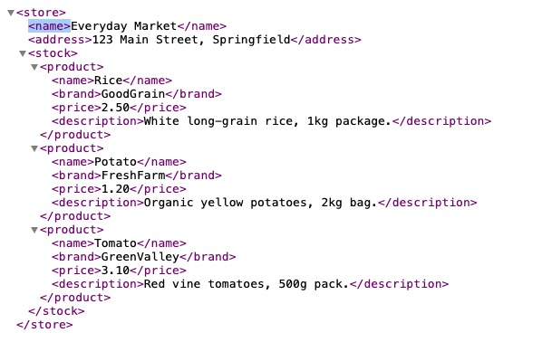

# LibreMacro – Complete Manual

## Table of Contents
1. [Introduction](#introduction)  
2. [Getting Started](#getting-started)  
3. [Features](#features)  
   - [Dialog Functions](#dialog-functions)  
   - [Spreadsheet Functions](#spreadsheet-functions)  
   - [Decoration & Formatting Functions](#decoration--formatting-functions)  
   - [Animation Functions](#animation-functions)  
   - [Template Functions](#template-functions)  
   - [Connection Functions](#connection-functions)  

---

## Introduction

**LibreMacro** is a library that makes it easier to create macros in **LibreOffice Calc**.  
It offers functions to manipulate spreadsheets, build dialogs, format cells, animate visual effects, generate template sheets, and consume external data.

Official repository: <https://github.com/LibreMacro/Library>  
Free course: [YouTube playlist](https://www.youtube.com/playlist?list=PLw7mAr9L5qIy_19pSCvfQtlq2ro0digtn)

---

## Getting Started

1. Download the `LibreMacro.oxt` file from the repository.  
2. In LibreOffice → **Tools** → **Extension Manager** → **Add…** → choose the `.oxt`.  
3. Restart LibreOffice. The functions will be available to your Basic macros.

---

## Features

### Dialog Functions

#### ConfirmDialog
Dialog box with **OK** and **Cancel**.  
```basic
ConfirmDialog(pQuestion As String, Optional pDialogTitle As String) As Boolean
```
**Return:** `True` if OK; `False` if Cancel.  

**Example:**
```basic
If ConfirmDialog("Do you want to save?", "Confirmation") Then
    ' Action if user clicked OK
else
    ' Action if user clicked Cancel
End If
```

---

#### QuestionDialog
Dialog box with **Yes** and **No**.  
```basic
QuestionDialog(pQuestion As String, Optional pDialogTitle As String) As Boolean
```
**Return:** `True` if Yes; `False` if No.  
**Example:**
```basic
If QuestionDialog("Print now?", "Question") Then
    ' Action if user clicked Yes
else
    ' Action if user clicked No
End If
```

---

#### RetryDialog
Dialog box with **Retry** and **Cancel**.  
```basic
RetryDialog(pQuestion As String, Optional pDialogTitle As String) As Boolean
```
**Return:** `True` if Retry; `False` if Cancel.  
**Example:**
```basic
Do While RetryDialog("Failed to connect. Try again?", "Error")
    ' ...
Loop
```

---

#### Dialog  
Internal utility function used by the three above to build the MessageBox with the appropriate icon.  
You normally don’t call `Dialog` directly — use `ConfirmDialog`, `QuestionDialog`, or `RetryDialog`.

#### Dialog3  
Utility variant of `Dialog` for additional scenarios/icons. Direct use is not necessary in most cases.

---

### Spreadsheet Functions

#### Cell
Accesses a specific cell and returns the `CellRange` object.  
```basic
Cell(pSheet As String, pCell As String) As Object
```
**Usage:**  
- `Cell(...).Value` → numbers  
- `Cell(...).String` → text  
**Example:**
```basic
Cell("Sheet1","A1").Value = 42
Cell("Sheet1","B1").String = "Hello"
```

---

#### Sheet
Returns a reference to a given sheet, whose name is provided in the input parameter `pSheet`.  
```basic
Sheet(pSheet As String) As Object
```
**Example:**
```basic
Dim s As Object
s = Sheet("Sheet1") 
```
In this example, the variable `s` will hold a reference to "Sheet1". With that, you can work with this object as you wish.

#### Row
Returns a reference to a given row, according to the input parameter `pRowIndex`.  
```basic
Row(pSheet As String, pRowIndex As Long) As Object
```
**Example:**
```basic
Row("Sheet1", 5).CellBackColor = RGB(240,240,240)  ' paints the 6th row
```

#### ActiveSheet
Returns the active sheet.  
```basic
ActiveSheet() As Object
```

#### ActiveSheetName
Returns the **name** of the active sheet.  
```basic
ActiveSheetName() As String
```

#### SelectCell
Selects a specific cell in a given sheet.  
```basic
SelectCell(pSheet As String, pCell As String)
```
**Example:**
```basic
SelectCell("Sheet1","C3") 
```
In this example, cell C3 of "Sheet1" will be selected.

#### SelectRow
Selects an entire **row** in a given sheet.   
```basic
SelectRow(pSheet As String, pRowIndex As Long)
```

---

#### CreateSheet
Creates a new sheet.  
```basic
CreateSheet(pName As String)
```
**Example:**
```basic
CreateSheet("Report")
```

#### RemoveSheet
Removes an existing sheet by name.  
```basic
RemoveSheet(pName As String) 
```
**Example:**
```basic
RemoveSheet("Sheet1")
```
In this example, "Sheet1" will be removed from the project. 

---

#### FindTextInCell
Searches for text inside a **cell**; returns `True` if it contains the substring.  
```basic
FindTextInCell(pText As String, pCell As String) As Boolean
```
**Example:**
```basic
If FindTextInCell("OK","C5") Then ... End If 
```
In this case, the macro will search for the text "OK" inside cell C5. If it finds it, it will execute the code inside the condition.

#### FindTextInColumn
Searches for text across an entire **column** (in the indicated sheet).  
```basic
FindTextInColumn(pSheet As String, pColIndex As Long, pText As String) As Boolean   ' (see notes)
```
**Example:**
```basic
If FindTextInColumn("Sheet1", 0, "Customer") Then ... End If 
```
In this case, the macro will search for the word "Customer" within "Sheet1" and, specifically, in the first column (0 → represents column A, i.e., the first column).

---

#### InsertRows
Inserts **n** rows starting from a (1‑based) row index.  
```basic
InsertRows(pSheet As String, IndexL As Long, Units As Long)
```
**Example:**
```basic
InsertRows("Sheet1", 3, 2)  ' inserts 2 rows before row 3
```

#### DeleteRows
Deletes **n** rows starting from an index.  
```basic
DeleteRows(pSheet As String, IndexL As Long, Units As Long)
```

---

#### InsertColumns
Inserts **n** columns starting at a **0‑based** index.  
```basic
InsertColumns(pSheet As String, IndexC As Long, Units As Long)
```
**Example:**
```basic
InsertColumns("Sheet1", 2, 1)  ' inserts before column C (A=0, B=1, C=2)
```

#### DeleteColumns
Deletes **n** columns starting at a **0‑based** index.  
```basic
DeleteColumns(pSheet As String, IndexC As Long, Units As Long)
```

---

#### InsertCellNote
Inserts/sets a **note** (comment) on the cell.  
```basic
InsertCellNote(pSheet As String, pCell As String, pNote As String)
```
**Example:**
```basic
InsertCellNote("Sheet1","D4","Attention: estimated value")
```

#### RemoveCellNote
Removes the note from the cell.  
```basic
RemoveCellNote(pSheet As String, pCell As String)
```

---

#### ClearContents
Clears content of a **range** (text, numbers, formulas).  
```basic
ClearContents(pSheet As String, pRange As String)
```
**Example:**
```basic
ClearContents("Sheet1","A1:C100")
```

---

#### SortAsc
Sorts a range in **ascending** order based on a reference column (0‑based).  
```basic
SortAsc(pSheet As String, pRange As String, pIndexC As Long)
```
**Example:**
```basic
SortAsc("Sheet1","A2:D100", 0)  ' sorts by column A
```

#### SortDesc
Sorts a range in **descending** order based on a reference column (0‑based).  
```basic
SortDesc(pSheet As String, pRange As String, pIndexC As Long)
```

---

### Decoration & Formatting Functions

The functions below change font, color, style, and create visual patterns.  

#### ChangeFontSize
Changes the **font size** in a range.  
```basic
ChangeFontSize(pSheet As String, pRange As String, pSize As Integer)
```
**Example:** 
```basic
ChangeFontSize("Sheet1","A1:B5", 12)
```
In this case, the macro will set the font size — regardless of the current value — to size 12.

#### ChangeFontColor
Changes the **font color**.  
```basic
ChangeFontColor(pSheet As String, pRange As String, pColor As Long)
```
**Example:** 
```basic
ChangeFontColor("Sheet1","A1:B5", RGB(0,90,180))
```
In this case, the range A1:B5 will use the color <span style="color:rgb(0,90,180)">RGB(0,90,180)</span>.

#### ChangeCellColor
Changes the **background color** of cells.  
```basic
ChangeCellColor(pSheet As String, pRange As String, pColor As Long)
```
**Example:** 
```basic
ChangeFontColor("Sheet1","A1:B5", "yellow")
```
In this case, the cells in range A1:B5 will have a <span style="color:yellow">yellow</span> background.

#### ChangeCellColor
Changes the **background color** of cells.  
```basic
ChangeCellColor(pSheet As String, pRange As String, pColor As Long)
```

#### ChangeCellStyle
Applies an existing **cell style** in the document.  
```basic
ChangeCellStyle(pSheet As String, pRange As String, pStyleName As String)
```
**Example:** `ChangeCellStyle("Sheet1","A1:D1","Heading 1")`

#### ChangeFontFormat
Enables/disables formatting such as **Bold/Italic/Underline**.  
```basic
ChangeFontFormat(pSheet As String, pRange As String, pBold As Boolean, _
                 Optional pItalic As Boolean, Optional pUnderline As Boolean)
```
**Example:** `ChangeFontFormat("Sheet1","B2:B10", True, True, False)`

#### CreateStripedLines
Creates **zebra lines** (alternating stripes) in a range.  
```basic
CreateStripedLines(pSheet As String, pRange As String, _
                   Optional pColor1 As Long, Optional pColor2 As Long, _
                   Optional pStripeHeight As Integer)
```
**Example:**
```basic
CreateStripedLines("Sheet1","A2:D100", RGB(248,248,248), RGB(235,235,235), 1)
```

#### ChangeFont
Changes the **font family/type**.  
```basic
ChangeFont(pSheet As String, pRange As String, pFamily As String)
```
**Example:** `ChangeFont("Sheet1","A1:C10","Liberation Sans")`

#### CopyFontColor
Copies the **font color** from a source cell to a target range.  
```basic
CopyFontColor(pSheet As String, pSourceCell As String, pTargetRange As String)
```
**Example:** `CopyFontColor("Sheet1","A1","B1:B50")`

---

### Animation Functions

Basic step-by-step visual effects on a range.

#### AnimateFontSize
Animates the **font size** between two values.  
```basic
AnimateFontSize(pSheet As String, pRange As String, _
                pFrom As Integer, pTo As Integer, _
                Optional pSteps As Integer, Optional pDelayMs As Long)
```
**Example:**
```basic
AnimateFontSize("Sheet1","A1", 10, 16, 6, 60)
```
In this example, cell A1 of "Sheet1" will animate from size 10 to size 16, in 6 steps, over 60ms.

#### AnimateFontColor
Animates the **font color** (interpolating between two colors).  
```basic
AnimateFontColor(pSheet As String, pRange As String, _
                 pColorFrom As Long, pColorTo As Long, _
                 Optional pSteps As Integer, Optional pDelayMs As Long)
```
**Example:**
```basic
AnimateFontColor("Sheet1", "B2:B10", "gray", "blue")
```
In this example, the cell range (B2:B10) receives an animation where the font initially appears in gray and transitions to blue.

#### ChangeFont (animation)
Animated shortcut to change the font with a gradual effect.  
```basic
ChangeFont(pSheet As String, pRange As String, pFamily As String, _
           Optional pSteps As Integer, Optional pDelayMs As Long)
```

#### ToggleCellColor
Creates an animation where a cell’s **background color** toggles between two colors **N** times. By default, this repetition occurs 5 times.
```basic
ToggleCellColor(pSheet As String, pRange As String, _
                pColor1 As Long, pColor2 As Long, _
                Optional pTimes As Integer, Optional pDelayMs As Long)
```
**Example:** 
```basic 
ToggleCellColor("Sheet1","A1", "yellow", "red", 10)
```
In this example, the background color of cell A1 alternates between yellow and red 10 times. At the end, it remains as the last specified color — red.

---

### Template Functions

#### CreateTemplateSheet

Quickly generates template sheets that are useful for **mocking data**, testing formulas, charts, and flows.

Note: Data are created in the `uf`, `names`, or `students` sheets (depending on the chosen option). If sheets with these names already exist, the template data will not be created.

---

##### Syntax
```basic
Sub CreateTemplateSheet(pOption As String, Optional pLang As String, Optional pQty As Integer)
```

**Examples:** 

```basic
CreateTemplateSheet("uf","pt")
```
Creates a sheet named "uf" containing a list of Brazilian states.

```basic
CreateTemplateSheet("uf","us")
```
Creates a sheet named "uf" containing a list of U.S. states.

```basic
CreateTemplateSheet("names","pt", 50)
```
Creates a sheet named "names" containing a list of 50 names, based on common names in Brazil.

```basic
CreateTemplateSheet("names","us", 300)
```
Creates a sheet named "names" containing a list of 300 names, based on common names in the United States.

```basic
CreateTemplateSheet("students","pt", 70)
```
Creates a sheet named "students" containing a list of 70 students, including name, course, and home state. The sheet uses common Brazilian names.

```basic
CreateTemplateSheet("students","us", 110)
```
Creates a sheet named "students" containing a list of 110 students, including name, course, and home state. The sheet uses common U.S. names.

---

### Connection Functions

#### GetXMLContent
Fetches **XML** content and assigns it to a given cell.  
```basic
GetXMLContent(pUrl As String, pTag As String) As String
```
 
**Example 1: Store with products in stock**

Given an XML containing products in stock (https://libremacro.github.io/Library/examples/store.xml), whose structure we reproduce below:



Here are some ways to fetch information from this XML and assign it to cells in a sheet:

a) Getting the store name and assigning it to cell A2 of "Sheet1"

```basic
Cell("Sheet1","A2").String = GetXMLContent("https://libremacro.github.io/Library/examples/store.xml", "/store/name")
```

b) Getting the store address and assigning it to cell C2 of "Sheet1"

```basic
Cell("Sheet1","C2").String = GetXMLContent("https://libremacro.github.io/Library/examples/store.xml", "/store/address")
```

c) Getting the name of the first product and assigning it to cell A4 of "Sheet1"

```basic
Cell("Sheet1","A4").String = GetXMLContent("https://libremacro.github.io/Library/examples/store.xml", "/store/stock/product[1]/name")
```

---

## Credits
A free software project created by Marcos Cabanas Esteves and Thiago Andrade. The project can be used free of charge and is open to contributions from anyone who wish to contribute.
